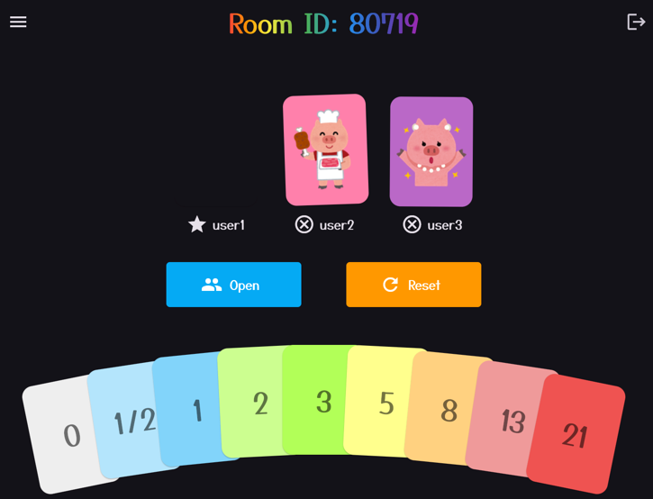
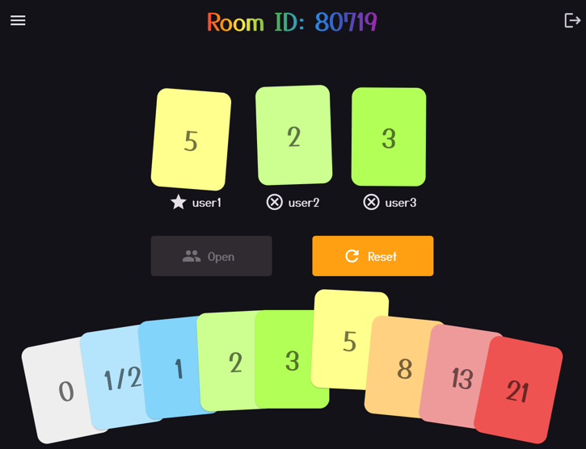

# Porker2

シンプルなスクラムポーカーアプリです。




## Architecture


- connectとは
  - https://connectrpc.com/
  - protobufから生成したハンドラでgRPC/gRPC-web/RestAPIでリクエストを受信可能なサーバを実装できるライブラリ

## Setup

開発環境のセットアップ方法です。

### 1. Go / Flutter / Docker / direnv のインストール
  - https://golang.org/doc/install
  - https://flutter.dev/docs/get-started/install
  - https://docs.docker.com/get-docker/
  - https://direnv.net/docs/installation.html

### 2. リポジトリのクローン
```bash
$ git clone git@github.com:swallowarc/porker2.git
$ cd porker2
```
### 3. toolのインストール
```bash
$ make setup/tools
```

### 4. .envrcファイルの作成
```bash
$ cp .envrc.sample .envrc
````

### 5. Redisの起動
```bash
$ make setup/redis
```

### 6. バックエンドの起動
```bash
$ make be/run-for-debug
```

### 7. フロントエンドの起動
```bash
$ make fe/run-for-debug
```

http://localhost:53676/ にアクセスするとアプリが起動します。

## Development

### 1. protobufの変更

`proto/` 以下の `.proto` ファイルでRPCのinterfaceを定義します。
protobufを変更した場合は、以下のコマンドでコードを生成してください。

```bash
$ make protoc
```

### 2. バックエンドの変更

`backend/` 以下にバックエンドのコードを記述します。

#### 2-1. mockの最新化

各種interfaceを変更した場合は、mockを最新化してください。

```bash
make mock/gen
```

### 3. フロントエンドの変更

`frontend/` 以下にフロントエンドのコードを記述します。

#### 3-1. フロントエンドのコード生成

`lib/presentation/router` パッケージや `frontend/lib/domain/usecase` 以下の各種Stateを変更した場合は、以下のコマンドでコードを生成してください。

```bash
make fe/build-runner
```
