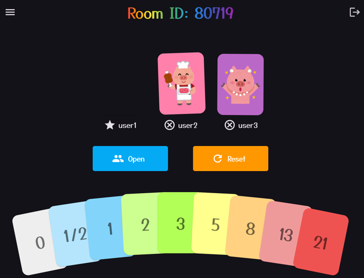
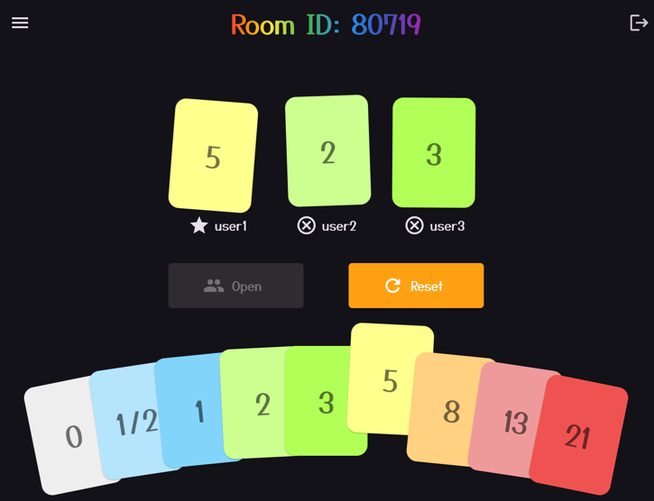

# Porker2

シンプルなスクラムポーカーアプリです。




## Architecture


- connectとは
  - https://connectrpc.com/
  - protobufから生成したハンドラでgRPC/gRPC-web/RestAPIでリクエストを受信可能なサーバを実装できるライブラリ

## Setup

開発環境のセットアップ方法です。

### 1. Go / Flutter / Docker / direnv のインストール
  - https://golang.org/doc/install
  - https://flutter.dev/docs/get-started/install
  - https://docs.docker.com/get-docker/
  - https://direnv.net/docs/installation.html

### 2. リポジトリのクローン
```bash
$ git clone git@github.com:swallowarc/porker2.git
$ cd porker2
```
### 3. toolのインストール
```bash
$ make setup/tools
```

### 4. .envrcファイルの作成
```bash
$ cp .envrc.sample .envrc
````

### 5. Redisの起動
```bash
$ make setup/redis
```

### 6. バックエンドの起動
```bash
$ make be/run-for-debug
```

### 7. フロントエンドの起動
```bash
$ make fe/run-for-debug
```

http://localhost:53676/ にアクセスするとアプリが起動します。

## 環境変数

バックエンドが参照する環境変数の一覧です。`.envrc.example` をベースに `.envrc` を作成して上書きしてください。

| キー | 必須 | 意味 | デフォルト値 |
| --- | --- | --- | --- |
| `ENV` |  | 実行環境の種別（`local` / `dev` / `prod`）。ロガーの出力形式などに影響します。 | `local` |
| `CONNECT_HOST` |  | Connect RPC サーバの待ち受けホスト。空の場合は全インタフェースで待ち受けます。 | （空文字列） |
| `CONNECT_PORT` |  | Connect RPC サーバの待ち受けポート。 | `8080` |
| `CONNECT_READ_TIMEOUT_SEC` |  | HTTP リクエスト読み込みのタイムアウト秒数。 | `30` |
| `CONNECT_WRITE_TIMEOUT_SEC` |  | HTTP レスポンス書き込みのタイムアウト秒数。長時間ストリーミングに合わせて長めに設定。 | `600` |
| `CONNECT_IDLE_TIMEOUT_SEC` |  | Keep-Alive 接続のアイドルタイムアウト秒数。 | `900` |
| `CONNECT_CORS_ALLOW_ORIGINS` | ✅ | CORS で許可するオリジンのカンマ区切りリスト（例: `http://localhost:53676`）。 | なし |
| `REDIS_HOST_PORT` |  | Redis 接続先 `host:port`。 | `localhost:6379` |
| `REDIS_PASSWORD` |  | Redis 認証パスワード。 | `password` |
| `REDIS_DB` |  | 使用する Redis のデータベース番号。 | `0` |
| `SESSION_COOKIE_DOMAIN` |  | セッション Cookie の `Domain` 属性。 | `localhost` |
| `SESSION_COOKIE_SECURE` |  | セッション Cookie の `Secure` 属性。HTTPS 配信時は `true` にします。 | `false` |

## Development

### 1. protobufの変更

`proto/` 以下の `.proto` ファイルでRPCのinterfaceを定義します。
protobufを変更した場合は、以下のコマンドでコードを生成してください。

```bash
$ make protoc
```

### 2. バックエンドの変更

`backend/` 以下にバックエンドのコードを記述します。

#### 2-1. mockの最新化

各種interfaceを変更した場合は、mockを最新化してください。

```bash
make mock/gen
```

### 3. フロントエンドの変更

`frontend/` 以下にフロントエンドのコードを記述します。

#### 3-1. フロントエンドのコード生成

`lib/presentation/router` パッケージや `frontend/lib/domain/usecase` 以下の各種Stateを変更した場合は、以下のコマンドでコードを生成してください。

```bash
make fe/build-runner
```
